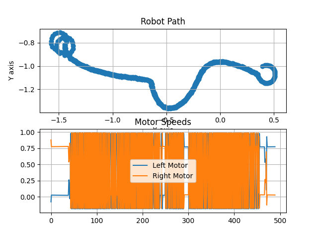

**Autonomous Mobile Robots Course**  
**Project Title**: Adaptive Line Follower with Obstacle Avoidance  
**Deadline**: 16.04.2025  
**Student Name**: [Adın Buraya]  

---

### **1. Objective**
The objective of this project is to implement a line-following mobile robot in CoppeliaSim using Python, which adaptively avoids obstacles by bypassing them from the **right side**, rather than the default left side. The project also involves performance optimization for faster lap completion and accurate lap time measurement.

---

### **2. Code Modifications**

#### **2.1 Obstacle Avoidance Direction Change**
The original behavior was to bypass obstacles from the **left** side. To change this, the motor control logic within the `OBSTACLE_AVOIDANCE` state was modified as follows:

**Original Code (Left Avoidance):**
```python
sim.setJointTargetVelocity(motors["left"], -0.5)
sim.setJointTargetVelocity(motors["right"], 0.5)
time.sleep(0.5)
```

**Modified Code (Right Avoidance):**
```python
sim.setJointTargetVelocity(motors["left"], 0.5)
sim.setJointTargetVelocity(motors["right"], -0.5)
time.sleep(0.5)
```

This change makes the robot rotate right instead of left before proceeding forward past the obstacle.

#### **2.2 PID Parameter Optimization**
PID parameters and base speed were tuned to enhance performance:

```python
Kp, Kd, Ki = 0.22, 0.02, 0.003
v_base = 0.6
```
These values were chosen based on several test runs to achieve balance between responsiveness and stability.

---

### **3. Lap Time Measurement**
Timers were added to record:
- 1st Lap Completion Time
- 2nd Lap Completion Time

The robot checks its distance from the starting point and records time at the first and second arrival. The results are printed to the console.

---

### **4. Robot Path Graph**
The robot path is recorded during simulation and visualized using matplotlib. Below is the graph of the path followed by the robot:



---

### **5. Screenshots of Simulation**
_(Eklenecek: CoppeliaSim ve terminal ekranından görüntüler)_

---

### **6. Conclusion**
The robot was successfully adapted to avoid obstacles from the right, with improved speed and accurate lap timing. The project demonstrates effective control logic modifications, real-time analysis, and simulation integration.

---

### **7. Files Submitted**
- Modified Python Code: `13_line_tracer_modified.py`
- Report: `report.pdf`
- Video Recording: `run_video.mp4` _(to be added)_

---

**Thank you!**

